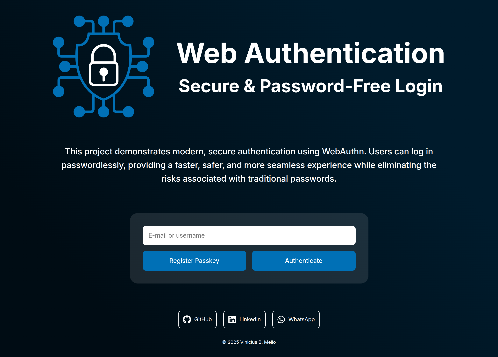
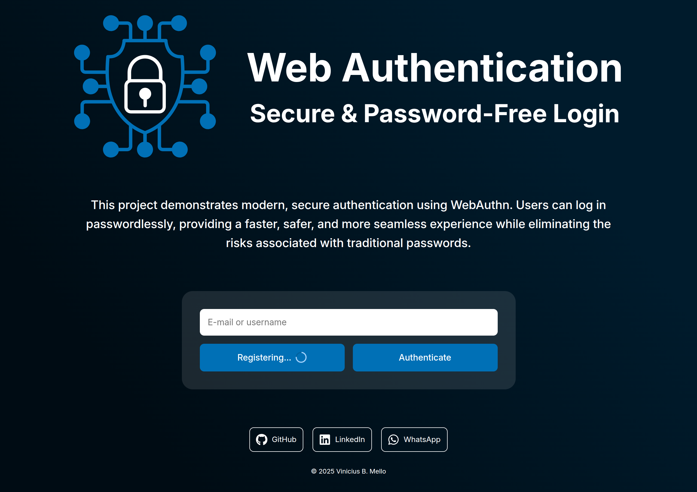
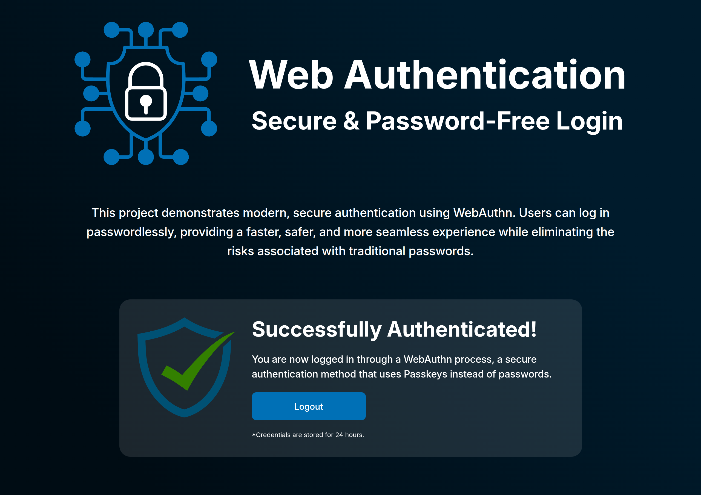

 

# Web Authentication

O projeto **Web Authentication** foi um aplicativo web que eu desenvolvi para praticar o uso de **WebAuthn** e da framework **Angular**. Permite que usários registrem uma **passkey** e faça autenticação sem senha e de forma segura. Criei um layout responsivo que se adaptava a diferentes tamanhos de tela por meio de **unidades de medida relativas** e **media queries**, ajustando o design conforme os pontos de interrupção para garantir uma aparência consistente.

Desenvolvi o projeto utilizando **Angular**, estruturando-o em componentes, com uma **API** própria desenvolvida no backend para persistir os dados do usuário e fazer também autenticação com **SimpleWebAuthn**, permitindo login e registro com **Passkey**, reforçando a segurança e melhorando a experiência do usuário.

**Confira o projeto em funcionamento clicando [aqui](https://webauth.protechadvanced.com/).**

## Tecnologias e Metodologias

- HTML5 semântico
- Metodologia BEM
- Flexbox
- Hover
- Pseudo-classe
- Unidades de medida relativas
- Media queries
- Angular
- API
- SimpleWebAuthn

## Descrição das Tecnologias e Técnicas Utilizadas

### HTML Semântico

Utilizei **HTML semântico** para tornar o código mais legível e acessível, facilitando a compreensão e a estruturação do conteúdo.

### Metodologia BEM

Adotei a **metodologia BEM** para facilitar a manutenção e escalabilidade do código, tornando a estrutura de classes mais clara.

### Flexbox

Apliquei `flexbox` em conjunto com **unidades de medida relativas** para organizar o layout e otimizar a responsividade, proporcionando uma boa experiência em diversos dispositivos.

### Pseudo-classes

Implementei as **pseudo-classes** `:hover` para melhorar a interatividade, alterando o estilo dos elementos.

### Media Queries

Configurei **media queries** para ajustar o layout em diferentes resoluções de tela, definindo pontos de interrupção específicos.

### Angular

Utilizei o **Angular** com **Typescript**, separando o código em componentes para melhor organização e reaproveitamento.

- **Seção de auth** – Criei um formulário que, com o uso do `FormControl` e `FormGroup`, vinculei os dados enviados a uma variavel pra ser enviada através dos metódos `onRegister()` e `onAuthenticate()` à **API**.

- **Preloader** – Implementei uma animação de carregamento controlada por `signal()`, exibida durante o registro e autenticação.

  

- **Seção do Perfil** – Implementei `provideRouter` como provedor e injetei o `router` no componente como dependência para navegar até a seção de perfil após a autenticação. Na seção indica uma autenticação bem-sucedida e inclui um botão para fazer logout.

  

- **Route Guards** - Foi utilizado as funções para proteger as rotas, utilizando **guestGuard** para redirecionar o usuário não authenticado para a pagina principal e o **userGuard** para redirecionar pra a seção do perfil caso authenticado.

### API

Desenvolvi classe de serviço para consumir uma **API** própria, implementei `provideHttpClient()` como provedor e injetei o `HttpClient` como dependência do componente para realizar requisições **GET** e **POST**. A classe permite realizar o **registro** e a **autenticação** de usuários.

#### SimpleWebAuthn

Implementei o módulo **SimpleWebAuthn** no front-end para realizar autenticação sem senha com **Passkey** usando **WebAuthn**. Utilizei os métodos `startAuthentication()` e `startRegistration()` para iniciar os fluxos de **login** e **registro** com autenticação forte baseada em hardware.

**Para mais informações do desenvolvimento do backend acesse clicando [aqui](https://github.com/Vinimello90/web_auth_backend#readme).**
